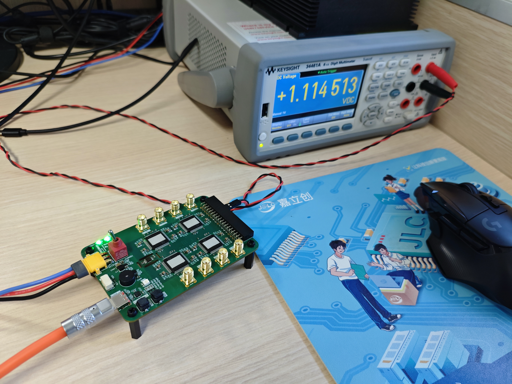

# SPDev
This repository stores some manuals about SPDev series devices 

manuals store in each device folder

## SPDac

SPDac is a device which can output 2 channel precision voltage & measure 4 channel SMA input voltage

## SPSMU

SPSMU is a 16 channel source measure unit device.

