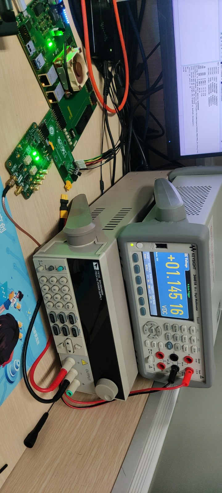
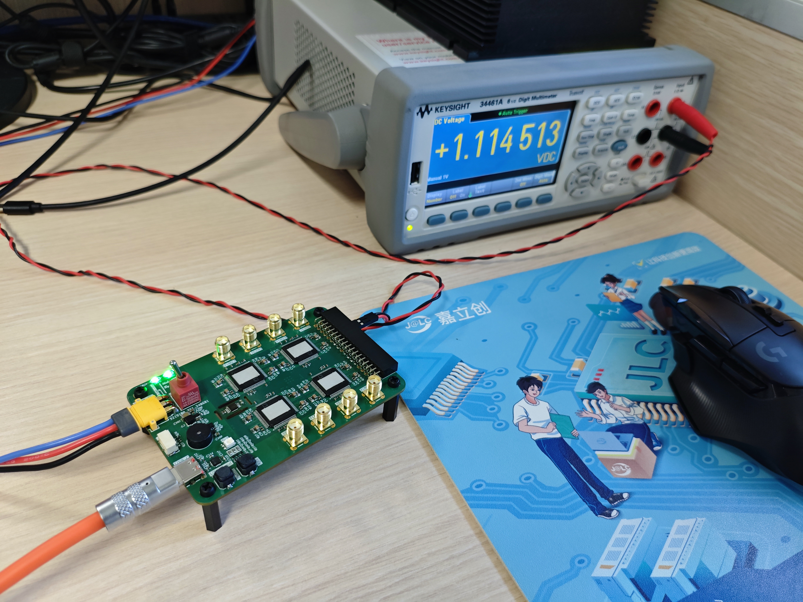

# SPDev

- [SPDev](#spdev)
  - [File tree](#file-tree)
  - [SPDev folder](#spdev-folder)
  - [SPDac](#spdac)
    - [SPDac design target](#spdac-design-target)
    - [SPDac test device](#spdac-test-device)
    - [SPDac test result](#spdac-test-result)
  - [SPSMU](#spsmu)
    - [SPSMU design target](#spsmu-design-target)
    - [SPSMU test device](#spsmu-test-device)
    - [SPSMU test result](#spsmu-test-result)

This repository stores some manuals & driver about SPDev series devices 

manuals are stored in each device folders

## File tree

    .
    ├── README.md
    ├── SPDac
    │   ├── CDM212364_Setup.exe
    │   ├── examples
    │   │   ├── SPDac_AWG.py
    │   │   ├── SPDac_connect.py
    │   │   └── SPDac_sweep.py
    │   ├── README.md
    │   ├── SPDac_env_cfg.bat
    │   ├── SPDac_env_cfg.md
    │   └── SPDac_env_cfg.sh
    ├── SPDev
    │   ├── __init__.py
    │   ├── __pycache__
    │   │   ├── __init__.cpython-311.pyc
    │   │   ├── __init__.cpython-312.pyc
    │   │   ├── __init__.cpython-39.pyc
    │   │   ├── SPDAC.cpython-311.pyc
    │   │   ├── SPDAC.cpython-312.pyc
    │   │   └── SPDAC.cpython-39.pyc
    │   └── SPDAC.py
    └── SPSMU
        ├── CH343SER.EXE
        ├── examples
        │   ├── SPSmu_test_curr.py
        │   ├── SPSmu_test_hizi.py
        │   ├── SPSmu_test_hizv.py
        │   └── SPSmu_test_volt.py
        └── README.md

## SPDev folder

this folder stores device's QCoDeS driver

## SPDac

SPDac is a device which can output 2 channel precision voltage & measure 4 channel SMA input voltage

SPDac manual is stored in SPDac folder(store as README.md), please click *SPDac* to read it

### SPDac design target

### SPDac test device

- Keysight 34461A
- Keysight 34970A
- Emoe EmoeNAP
- YOKOGAWA GS200
- Siglent SDS804X

### SPDac test result

## SPSMU

SPSMU is a 16 channel source measure unit device.

SPSMU manual is stored in SPSMU folder(store as README.md), please click *SPSMU* to read it

<!--  -->

### SPSMU design target

### SPSMU test device

- Keysight 34461A
- YOKOGAWA GS200
- Keithley 2450

### SPSMU test result